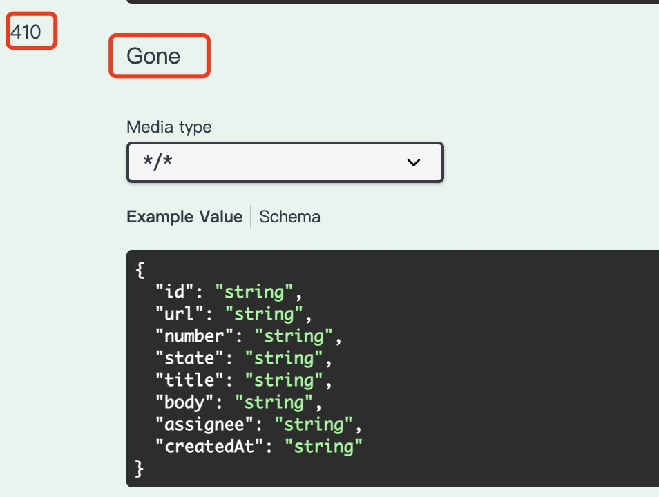

# OpenAPI 3 Spec

## Import dependencies

```xml
   <dependency>
      <groupId>org.springdoc</groupId>
      <artifactId>springdoc-openapi-starter-webmvc-ui</artifactId>
      <version>2.1.0</version>
   </dependency>
```

## Swagger UI and OpenAPI 3 Spec

Swagger UI:
- http://server:port/context-path/swagger-ui.html
- http://localhost:8080/swagger-ui.html

OpenAPI 3 Spec:
- JSON: 
  - http://server:port/context-path/v3/api-docs
  - http://localhost:8080/v3/api-docs
- YAML: 
  - http://server:port/context-path/v3/api-docs.yaml
  - http://localhost:8080/v3/api-docs.yaml


## Customize API definition on Swagger UI

Use `@OpenAPIDefinition` to customize the Swagger UI:

- Title
- Version
- Description
- Terms of service
- Website
- Email
- License
- Servers


Configuration class:

```java
@OpenAPIDefinition(
        info = @Info(
                title = "Issues",
                version = "2022-11-28",
                description = "Use the REST API to view and manage issues, including issue assignees, comments, labels, and milestones.",
                license = @License(
                        name = "Apache 2.0",
                        url = "https://www.apache.org/licenses/LICENSE-2.0"
                ),
                termsOfService = "https://docs.github.com/en/site-policy/github-terms/github-terms-of-service",
                contact = @Contact(
                        name = "GitHub",
                        url = "https://github.com",
                        email = "api@github.com"
                )
        ),
        servers = {
                @Server(
                        description = "GitHub",
                        url = "https://api.github.com"
                ),
                @Server(
                        description = "Local Env",
                        url = "http://localhost:8080"
                )
        }
)
public class OpenAPIConfig {
}
```

Notes:
- This example defines two servers.


## Authorize on Swagger UI

TODO

## Customize Controller and Method on Swagger UI

Use `@Tag` to customize controller.


```java
@RestController
@Tag(name = "Issues", description = "Use the REST API to manage issues and pull requests.")
public class IssueController {
    // ...
}
```

Use `@Operation` to customize method.

- Method summary and description
- Response status code and description




```java
@PostMapping("/repos/{owner}/{repo}/issues")
@ResponseStatus(HttpStatus.CREATED)
@Operation(
        summary = "Create an issue",
        description = "Any user with pull access to a repository can create an issue. " +
                "If issues are disabled in the repository, the API returns a 410 Gone status.",
        responses = {
                @ApiResponse (
                        description = "Created",
                        responseCode = "201"
                ),
                @ApiResponse (
                        description = "Forbidden",
                        responseCode = "403"
                ),
                @ApiResponse (
                        description = "Resource not found",
                        responseCode = "404"
                ),
                @ApiResponse (
                        description = "Gone",
                        responseCode = "410"
                ),
                @ApiResponse (
                        description = "Validation failed, or the endpoint has been spammed.",
                        responseCode = "422"
                ),
                @ApiResponse (
                        description = "Service unavailable",
                        responseCode = "503"
                )
        }
)
public CreateIssueResponseDTO createIssue(@PathVariable("owner") String owner, @PathVariable("repo") String repo,
@RequestBody CreateIssueRequestDTO createIssueRequestDTO) {
    // ...
}
```

## Customize Schema on Swagger UI

Use `@Schema` combine with Java validation annotations to customize schema.
- Request body example values
- Request body schema


```java
@Data
@AllArgsConstructor
@NoArgsConstructor
@Builder
public class CreateIssueRequestDTO {
    @Schema(example = "Found a bug")
    @NotBlank
    private String title;
    @Schema(example = "I'm having a problem with this.")
    @NotBlank
    private String body;
    @Schema(example = "William")
    @NotNull
    private String assignee;
}
```

Notes:
- `@NotBlank` means the field is required.

You also can use `@Schema` to customize path variables.


```java
public CreateIssueResponseDTO createIssue(@PathVariable("owner")
                                                  @Schema(description = "The account owner of the repository. The name is not case sensitive.")
                                                  String owner,
                                              @PathVariable("repo")
                                              @Schema(description = "The name of the repository. The name is not case sensitive.")
                                              String repo,
                                              @RequestBody CreateIssueRequestDTO createIssueRequestDTO) {
    // ...
        }
```


## Hide Controller and Method on Swagger UI

Use `@Hidden` to hide controller or controller method on Swagger UI.

## Disable Swagger UI and OpenAPI 3 Spec

Disable Swagger UI and OpenAPI 3 Spec in `application-prod.yaml` for production environment.
```yaml
springdoc:
  swagger-ui:
    enabled: false
  api-docs:
    enabled: false
```

### Test with non-prod profile

Maven run:
```bash
mvn spring-boot:run
```

Java run:
```bash
mvn clean install
java -jar target/*.jar
```

You should access Swagger UI and OpenAPI 3 Spec.

### Test with prod profile
Maven run with `prod` profile.
```bash
mvn spring-boot:run -Dspring-boot.run.jvmArguments="-Dspring.profiles.active=prod"
```

Java run with `prod` profile.
```bash
mvn clean install
java -Dspring.profiles.active=prod -jar target/*.jar
```

You should NOT access Swagger UI and OpenAPI 3 Spec.

## References

- https://springdoc.org/v2/
- https://springdoc.org/faq.html